# Markup Attributes

A Unity Editor extension for customizing inspector layout with attributes.

#### Key Features

* Create tabs, boxes, foldouts and other groups, hide/disable properties on condition, inline editors.
* Works in C# and in ShaderLab. 
* The inspector allows to inject custom code into it before/after/instead of any property.
* MIT licensed, small, opt-in. 

## Why?

__Note:__ _This is an early version of the extension, so expect bugs. If you find this thing useful, please, don't hesitate to try it out and let me know about any problems here or on Twitter @pensionerov._

Anyone who wrote custom editors knows, that they are prone to boilerplate and often rely on hardcoded names of the properties, which adds unnecessary friction to development process.  One way to deal with it is to use C# Attributes, and the most prominent project to do so is [Odin Inspector](https://odininspector.com/). It is great, but it can't be used in open source and on the Asset Store because it's paid and huge. Also, as far as know, it doesn't do anything for shader editors, which drag with them even more boilerplate and bookkeeping that the regular ones. So, here is my take on the problem. 

Markup Attributes is MIT licensed and relatively small, focusing exclusively on editor layout. It works both in C# and in ShaderLab. Custom inspector provides hooks at any of the properties, which makes it possible to extend the inspector without loosing the layout functionality. 

## Table of Contents

1. [Installation](#installation)
2. [Usage](#usage)
   * [MonoBehaviour and ScriptableObject](#monobehaviour-and-scriptableobject)
   * [Serializable classes and structs](#serializable-classes-and-structs)
   * [Shaders](#shaders)
   * [Nesting Groups](#nesting-groups)
   * [ShaderLab Specifics](#shaderlab-specifics)
3. [Group Attributes](#group-attributes)
   * [Box](#box)
   * [TitleGroup](#titlegroup)
   * [Foldout](#foldout)
   * [TabScope and Tab](#tabscope-and-tab)
   * [HorizontalGroup and VerticalGroup](#horizontalgroup-and-verticalgroup)
   * [HideIfGroup and ShowIfGroup](#conditional-groups)
   * [DisableIfGroup and EnableIfGroup](#conditional-groups)
   * [ToggleGroup](#togglegroup)
4. [Special Attributes](#special-attributes)
   * [EndGroup](#endgroup)
   * [MarkedUpField](#markedupfield)
   * [InlineEditor](#inlineeditor)
   * [CompactTexture](#compacttexture)
   * [DrawSystemProperties](#drawsystemproperties)
5. [Extending Marked Up Inspectors](#extending-marked-up-inspectors)

## Installation

Download the [.unitypackage](https://github.com/gasgiant/MarkupAttributes/releases/tag/v0.2.0) and import it into your project.

## Usage

#### MonoBehaviour and ScriptableObject

For `MonoBehaviour`s and `ScriptableObject`s you need to create a custom editor that inherits form `MarkedUpEditor`:

```c#
using UnityEditor;
using MarkupAttributes;

[CustomEditor(typeof(MyComponent)), CanEditMultipleObjects]
internal class MyComponentEditor : MarkedUpEditor
{        
}
```

Alternatively, you can apply `MarkedUpEditor` to all classes that inherit from `MonoBehaviour` or `ScriptableObject` and don't have their own custom editor:

```c#
[CustomEditor(typeof(MonoBehaviour), true), CanEditMultipleObjects]
internal class MarkedUpMonoBehaviourEditor : MarkedUpEditor
{
}

[CustomEditor(typeof(ScriptableObject), true), CanEditMultipleObjects]
internal class MarkedUpScriptableObjectEditor : MarkedUpEditor
{
}
```

#### Serializable classes and structs

To make the attributes work inside serialized classes or structs you need to add `MarkedUpField` attribute to the fields containing them:

```c#
[System.Serializable]
class MyClass
{
    ...
}

class MyComponent : MonoBehaviour
{
    [MarkedUpField]
    public MyClass myClass;
}
```

Note, that the attributes will work in marked up fields only inside `MarkedUpEditor`. You can nest marked up fields inside other marked up fields .

#### Shaders

To apply attributes to the materials with a certain `Shader ` you should tell Unity to use `MarkedUpShaderGUI`:

```javascript
Shader "Unlit/MyShader"
{
    Properties
    {
        ...
    }

    CustomEditor "MarkupAttributes.Editor.MarkedUpShaderGUI"
    
    ...
}
```

#### Nesting Groups

Any group attribute requires a path in group hierarchy. The last entry in the path is the name of the group.

```c#
[Foldout("Group")]
public int one;
[TitleGroup("Group/Nested Group")]
public int two;
public int three;
```

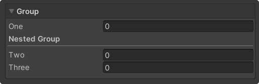

Starting a group closes all groups untill the path match.

```c#
[Foldout("Group")]
public int one;
[TitleGroup("Group/Nested Group 1")]
public int two;
public int three;
[TitleGroup("Group/Nested Group 2")]
public int four;
public int five;
```

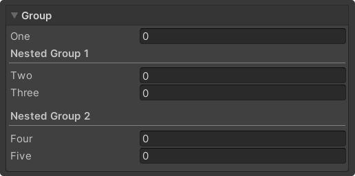

`./` shortcut opens a group on top of the current one, `../` closes the topmost group and then opens a new one on top. 

```c#
[Foldout("Group")]
public int one;
[TitleGroup("./Nested Group 1")]
public int two;
public int three;
[TitleGroup("../Nested Group 2")]
public int four;
public int five;
```

`EndGroup` closes the topmost group, or, when provided with a name, closes the named group and all of its children. 

```c#
[Foldout("Group")]
public int one;
[Box("./Nested Group")]
public int two;
public int three;
[EndGroup("Group")]

public int four;
public int five;
```

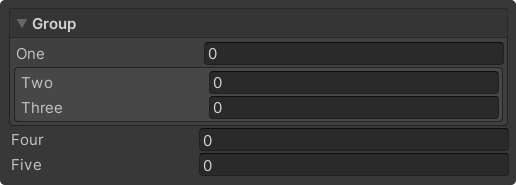

#### ShaderLab Specifics

Unfortunately, ShaderLab does not allow any special symbols in property attributes. Because of that, we can't use `/` to write paths and have to replace them with spaces. Underscores then mark were you want actual spaces to be. Also, unlike in C#, you should not use quotes around the strings. Foe example, instead of

 `[Box("Parent Group/My Box")] ` 

you would write 

`[Box(Parent_Group My_Box)]` .

The same goes for shortcuts, so 

`[Box("./My Box")] ` and `[Box("../My Box")] `

becomes

 `[Box(. MyBox)] ` and `[Box(.. My_Box)] ` .

## Group Attributes

#### Box

Starts a group in a box. Can be or not be labeled. 

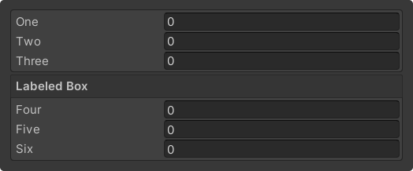

```c#
// C#
[Box("Unlabeled Box")]
public int one;
public int two;
public int three;

[Box("Labeled Box", labeled: true)]
public int four;
public int five;
public int six;
```

```javascript
// ShaderLab
[Box(Unlabeled_Box)]
_One("One", Float) = 0
_Two("Two", Float) = 0
_Three("Three", Float) = 0

[Box(Labeled_Box, true)]
_Four("Four", Float) = 0
_Five("Five", Float) = 0
_Six("Six", Float) = 0
```

#### TitleGroup

Starts a vertical group with an underlined title. 

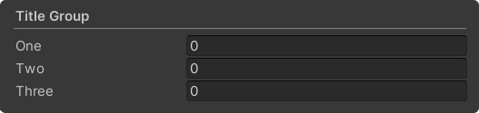

```c#
// C#
[TitleGroup("Title Group")]
public int one;
public int two;
public int three;
```

```javascript
// ShaderLab
[TitleGroup(Title_Group)]
_One("One", Float) = 0
_Two("Two", Float) = 0
_Three("Three", Float) = 0
```

#### Foldout

Starts a collapsible group. Can be or not be boxed. 

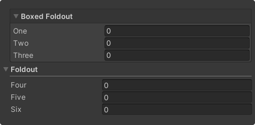

```c#
// C#
[Foldout("Boxed Foldout")]
public int one;
public int two;
public int three;

[Foldout("Foldout", boxed: false)]
public int four;
public int five;
public int six;
```

```javascript
// ShaderLab
[Foldout(Boxed_Foldout)]
_One("One", Float) = 0
_Two("Two", Float) = 0
_Three("Three", Float) = 0

[Foldout(Foldout, false)]
_Four("Four", Float) = 0
_Five("Five", Float) = 0
_Six("Six", Float) = 0
```

#### TabScope and Tab

`TabScope` creates a control for switching tabs. Can be or not be boxed. `Tab` starts a group placed on a specified page. Names of the pages must match the names defined in `TabScope`. 

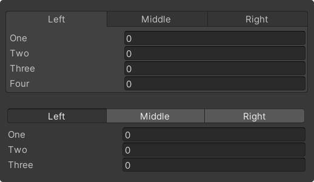

```c#
// C#
[TabScope("Tab Scope", "Left|Middle|Right", boxed: true)]
[Tab("./Left")]
public int one;
public int two;
public int three;

[Tab("../Middle")]
public int four;
public int five;
public int six;

[Tab("../Right")]
public int seven;
public int eight;
public int nine;
```

```javascript
// ShaderLab
[TabScope(Tab_Scope, Left Middle Right, true)]
[Tab(. Left)]
_One("One", Float) = 0
_Two("Two", Float) = 0
_Three("Three", Float) = 0

[Tab(.. Middle)]
_Four("Four", Float) = 0
_Five("Five", Float) = 0
_Six("Six", Float) = 0

[Tab(.. Right)]
_Seven("Seven", Float) = 0
_Eight("Eight", Float) = 0
_Nine("Nine", Float) = 0
```

#### HorizontalGroup and VerticalGroup

`HorizontalGroup` starts a horizontal group, takes label width as an argument.  `VerticalGroup` starts a vertical group. Note, that `Box`, `TitleGroup`, `Foldout` and `ToggleGroup` are also vertical groups. 

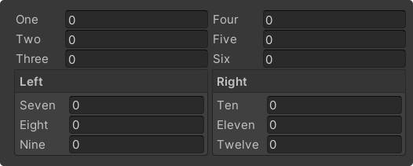

```c#
// C#
[HorizontalGroup("Split", labelWidth: 50)]
[VerticalGroup("./Left")]
public int one;
public int two;
public int three;

[VerticalGroup("../Right")]
public int four;
public int five;
public int six;
```

```javascript
// ShaderLab
[HorizontalGroup(Split, 50)]
[VerticalGroup(. Left)]
_One("One", Float) = 0
_Two("Two", Float) = 0
_Three("Three", Float) = 0

[VerticalGroup(.. Right)]
_Four("Four", Float) = 0
_Five("Five", Float) = 0
_Six("Six", Float) = 0
```

#### Conditional Groups

`HideIfGroup` and `ShowIfGroup` hide/show their contents depending on a condition.

`DisableIfGroup` and `EnableIfGroup` disable/enable their contents depending on a condition. 

In C# the condition can be a bool field, bool property, or a method, that returns bool and takes no arguments. Members can be instance of static. 

In ShaderLab the condition can be a float property (true if greater than zero, false otherwise), material keyword, or a global keyword. 

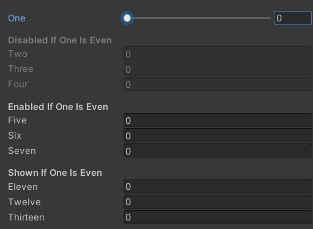

```c#
// C#
private bool boolField;
private bool BoolProperty => one % 2 == 0;
private static bool BoolMethod() => true;

[DisableIfGroup("Disabled If Field", nameof(boolField))]
public int one;
public int two;

[HideIfGroup("Hide If Property", nameof(BoolProperty))]
public int three;
public int four;

[EnableIfGroup("Enable If Method", nameof(BoolMethod))]
public int five;
public int six;
```

```javascript
// ShaderLab
_Toggle("Toggle", Float) = 0

[ShowIfGroup(Show_If_Float, _Toggle)]
_One("One", Float) = 0
_Two("Two", Float) = 0

[EnableIfGroup(Enable_If_Keyword, MY_KEYWORD)]
_Three("Three", Float) = 0
_Four("Four", Float) = 0

[DisableIfGroup(Hide_If_Global_Keyword, G MY_KEYWORD)]
_Five("Five", Float) = 0
_Six("Six", Float) = 0
```

#### ToggleGroup

Starts a group that can be turned on or off. Can be foldable. 

In C# should be used on a serialized bool field. 

In ShaderLab should be used on a float property. Optionally can turn keyword on a material on and off together with the float (similarly to how built-in Toggle drawer does).

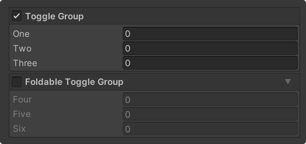

```c#
// C#
[ToggleGroup("Toggle Group")]
public bool boolean;
public int one;
public int two;
public int three;

[ToggleGroup("Foldable Toggle Group", foldable: true)]
public bool anotherBoolean;
public int four;
public int five;
public int six;
```

```javascript
// ShaderLab
[ToggleGroup(Toggle_Group)]
_Toggle("Toggle", Float) = 0
_One("One", Float) = 0
_Two("Two", Float) = 0
_Three("Three", Float) = 0

[ToggleGroup(Toggle_Group_With_Keyword, true, MY_KEYWORD)]
_AnotherToggle("Another Toggle", Float) = 0
_Four("Four", Float) = 0
_Five("Five", Float) = 0
_Six("Six", Float) = 0
```

## Special Attributes

#### EndGroup

Closes the topmost group. If provided with a name, closes the named group and all its children.

#### MarkedUpField

_C# only_

Makes attributes work inside serializable classes and structs. See [Usage: Serializable classes and structs](serializable-classes-and-structs). Can be used on serialized fields of serializable classes and structs. Can optionally hide the target's control (foldout) and remove indent from target's children. 

```c#
[MarkedUpField]
public SomeClass one;

[MarkedUpField(indentChildren: false)]
public SomeClass two;

[MarkedUpField(indentChildren: false, showControl: false)]
public SomeClass three;
```

#### InlineEditor

_C# only_

Shows inspector of some `Unity.Object` (`MonoBehaviour`, `ScripatableObject` and `Material` are `Unity.Object`s, for instance) "inline" — embeds it in the current inspector. Can be used on an object reference field. Works in `MarkedUpEditor`s and `MarkedUpProperty`s inside them. By default shows an object field with the foldable inspector body in a box. If `stripped` only draws inspector body (provided that object reference isn't null).


```c#
[InlineEditor]
public SomeComponent component;

[InlineEditor]
public Material material;

[InlineEditor(stripped: true)]
public SomeComponent stripped;
```

#### CompactTexture

_ShaderLab only_

Draws compact texture property. Can be used on a texture property, works inside `MarkedUpShaderGUI`. Can draw both scale and offset fields, only the scale field or only the scale field with uniform scaling on both directions.

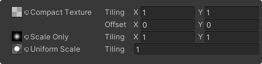

```javascript
[CompactTexture]
_Texture1("Compact Texture", 2D) = "white" {}
[CompactTexture(ScaleOnly)]
_Texture2("Scale Only", 2D) = "white" {}
[CompactTexture(UniformScaleOnly)]
_Texture3("Uniform Scale", 2D) = "white" {}
```

#### DrawSystemProperties

_ShaderLab only_

When added to any property tells `MarkedUpShaderGUI` to draw Render Queue and Double Sided
Global Illumination properties below the inspector.

```javascript
[DrawSystemProperties]
_AnyProperty("Any one will do", Float) = 0
```

## Extending Marked Up Inspectors

### Regular Inspectors

`MarkedUpEditor` allows to inject custom code into itself before, after and instead of any property. Here are the methods used for extension:

* `DrawMarkedUpInspector()` — works like `Editor`'s  `DrawDefaultInspector`, but for the marked up editor. Call it if you have overridden the `OnInspectorGUI` and want to draw `MarkedUpEditor` as is. 
* `OnInitialize()` — is called after `MarkedUpEditor` have initialized itself in `OnEnable`. 
* `AddCallback(SerializedProperty property, CallbackEvent type, Action<SerializedProperty> callback)` — adds a callback to a specified `SerializedProperty ` at a specified `CallbackEvent `. Only one callback can be added for a given property at a given event. Should be used in `OnInitialize`.
* `OnCleanup()` — is called before `MarkedUpEditor` started cleanup in `OnDisable`. 

```c#
using UnityEditor;
using UnityEngine;
using MarkupAttributes.Editor;

[CustomEditor(typeof(MyComponent))]
public class MyComponentEditor : MarkedUpEditor
{
    protected override void OnInitialize()
    {
        AddCallback(serializedObject.FindProperty("one"), 
            CallbackEvent.AfterProperty, ButtonAfterOne);

        AddCallback(serializedObject.FindProperty("six"),
            CallbackEvent.BeforeProperty, ButtonBeforeSix);

        AddCallback(serializedObject.FindProperty("three"),
            CallbackEvent.ReplaceProperty, ButtonReplaceThree);
    }

    private void ButtonAfterOne(SerializedProperty property)
    {
        GUILayout.Button("After One");
    }

    private void ButtonBeforeSix(SerializedProperty property)
    {
        GUILayout.Button("Before Six");
    }

    private void ButtonReplaceThree(SerializedProperty property)
    {
        GUILayout.Button("Replace Three");
    }
}
```

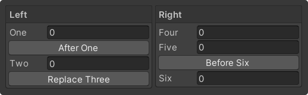

### ShaderGUI

`MarkedUpShaderGUI` can be extended in a similar manner. It provides the following methods:

* `OnInitialize(MaterialEditor materialEditor, MaterialProperty[] properties)` — is called after `MarkedUpShaderGUI` have initialized itself. `AddCallback` should be used here.
* `AddCallback(MaterialProperty property, CallbackEvent type, Action<MaterialEditor, MaterialProperty[], MaterialProperty> callback)`  — adds a callback to a specified `MaterialProperty ` at a specified `CallbackEvent `. Only one callback can be added for a given property at a given event. Should be used in `OnInitialize`.

```c#
using UnityEditor;
using UnityEngine;
using MarkupAttributes.Editor;

public class MyShaderEditor : MarkedUpShaderGUI
{
    protected override void OnInitialize(MaterialEditor materialEditor, MaterialProperty[] properties)
    {
        AddCallback(FindProperty("_Color", properties), CallbackEvent.AfterProperty, ButtonAfterColor);
    }

    private void ButtonAfterColor(MaterialEditor materialEditor, MaterialProperty[] properties,
        MaterialProperty property)
    {
        GUILayout.Button("Button After Color");
    }
}
```

Don't forget to tell Unity to use the modified editor for your shader.

```javascript
Shader "Unlit/MyShader"
{
    Properties
    {
        ...
    }

    CustomEditor "MyShaderEditor"
    
    ...
}
```


